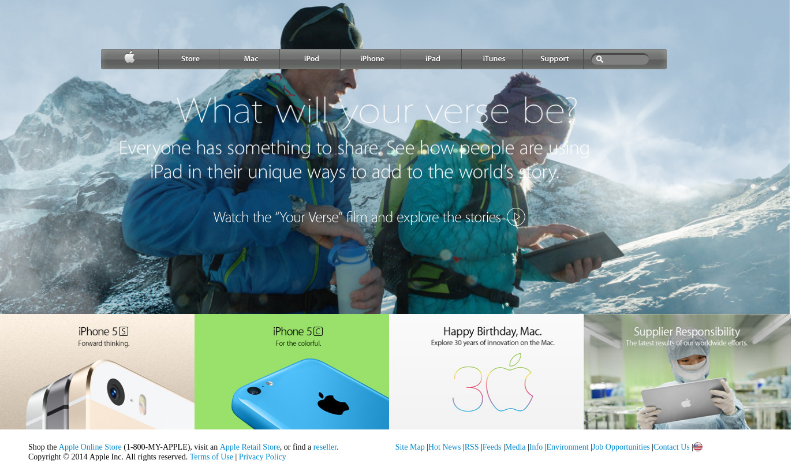

# Apple-clone WebSite

> This project consists of building a webpage using images as a background and adding gradients to elements. The goal is to make a clone of old an old version of the Apple website webpage. 

## Built With

- HTML5 ands
- CSS3

## Live Demo

[Live Demo Link](https://morrism1.github.io/apple-clone/)

## Author

👤 **Maurice Murangwa**

- Github: [@Morrism1](https://github.com/Morrism1)
- Twitter: [@MorrisMontana0](https://twitter.com/MorrisMontana0)
- Linkedin: [Maurice Murangwa](https://www.linkedin.com/in/murangwa-maurice-769549140/)

## 🤝 Contributing

Contributions, issues and feature requests are welcome!

Feel free to check the [issues page](issues/).

## Show your support

Give a ⭐️ if you like this project!

## 📝 License

This project is [MIT](lic.url) licensed.
